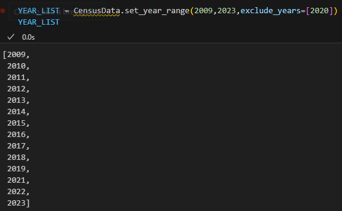
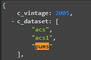
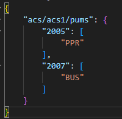

# Downloading Census Data Through API

Author: Nick Occhipinti

This Python code will allow you to download Census data through the API url at [https://api.census.gov/data](https://api.census.gov/data).  The following information is required in order to use the code:
 * **years**: The list of years you want from the dataset.  In the **census_data_notebook.ipynb** There is a call made to ```CensusData.set_year_range()``` where you can provide the start and end year and if there are any years you want to exclude.  It will provide a list of years and then you can just loop through all the years and get the Census data for each year.
 
 * **state_code**:  North Carolina is **'37'** and South Carolina is **'45'**.
 * **dataset_path**: The dataset path that will be used to navigate through the API url in order to get the data.  For example in order to get the ACS 1 Year Estimates for PUMS data the dataset path is **acs/acs1/pums**.  In the API you can find the different parts of dataset path in the **c_dataset** key in the API.
  
* **key_fields**: This is the unique column(s) that identifies each record. This is needed because the code will make multiple requests to the API with different variables and then the will be combined into one data frame using the key fields.  For example the fields that make the PUMS data unique is SERIALNO and SPORDER so key_fields is set to **['SERIALNO','SPORDER']**.
* **api_key**: This is the key provide by the Census when you request a key at [https://api.census.gov/data/key_signup.html](https://api.census.gov/data/key_signup.html).
* **variable_export_list**: By default this is set to **None**, meaning it will get all the variables listed in the **variables.json** file linked to each year and dataset in the API.  If you are interested in only a subset of variables you can add it to this parameter in the format **['VARIABLE1','VARIABLE2']**.
* **exclude_variables**: There is JSON file called **exclude_variables.json** which is organized by the dataset path and further by year and it contains a list of variables that should be excluded from the requests related to this dataset and time period because they are not available and generate an error.  As new cases are found they will be added to this file.
.


